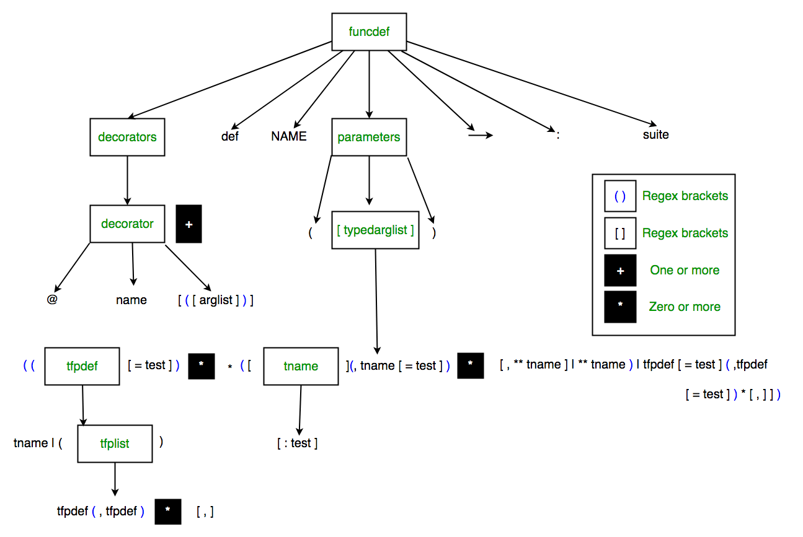

# 0x00-python_variable_annotations

<h2>
 Python Variable Annotations: Enhancing Clarity and Type Checking 
</h2>

<ul>
  <li>
    Python variable annotations provide a powerful tool for enhancing code clarity and enabling more robust type checking.
  </li>
    <li>
    By explicitly declaring the type of a variable using annotations, developers can improve code readability and catch potential type errors early on.
  </li>
    <li>
    Variable annotations also enable static type checkers like mypy to analyze code more effectively and provide valuable insights during development.
  </li>
  <li>
    With the introduction of variable annotations in Python 3.6, it has become easier to write self-documented code and improve collaboration within teams.
  </li>
    <li>
    Embracing variable annotations in Python not only leads to more reliable code but also promotes better code maintenance and overall software quality.
  </li>
</ul>
