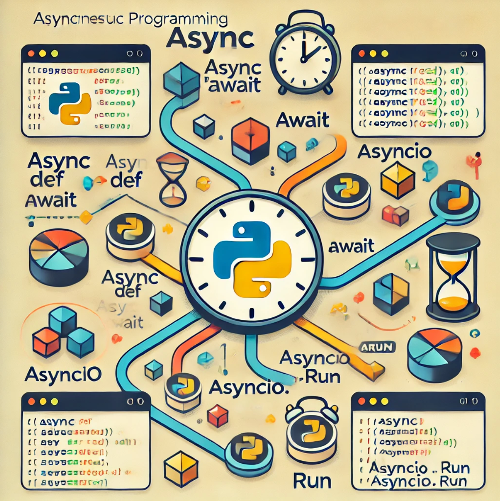

# 0x01-python_async_function

<h2>
  Exploring Python Async Functions
</h2>

  Python async functions provide a way to handle concurrent tasks efficiently, particularly for I/O-bound operations like image processing. By using the async and await keywords, code can run multiple operations concurrently without blocking other tasks. This is especially useful when working with tasks that involve waiting for I/O operations, such as reading and processing images. With the help of libraries like asyncio, developers can write concurrent code easily. Async functions make Python an ideal choice for handling complex tasks effortlessly.

